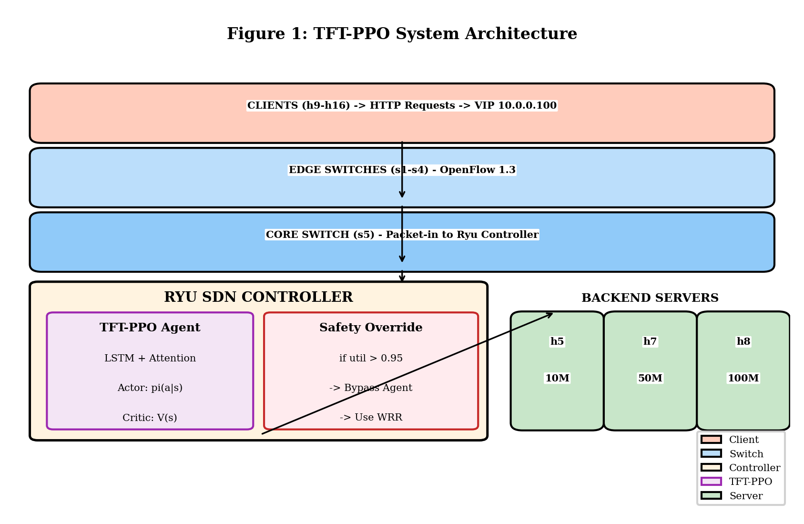
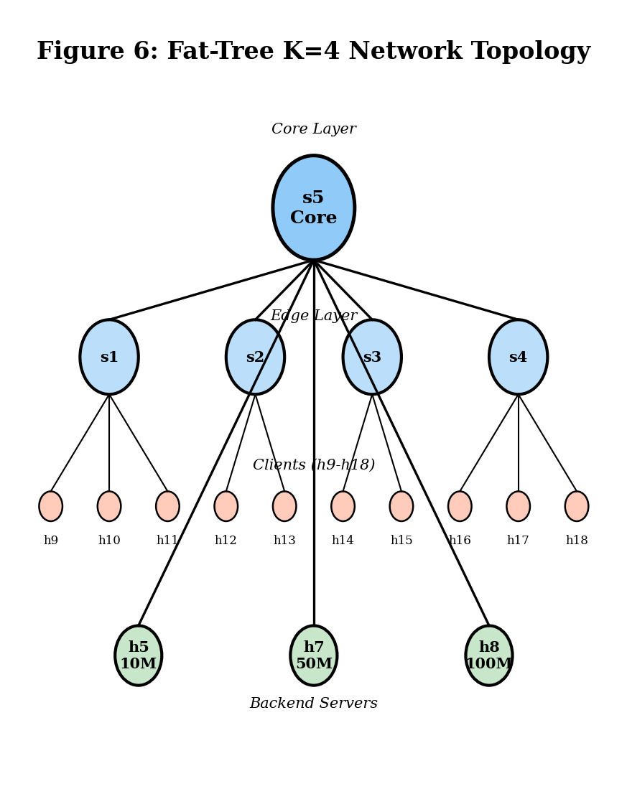
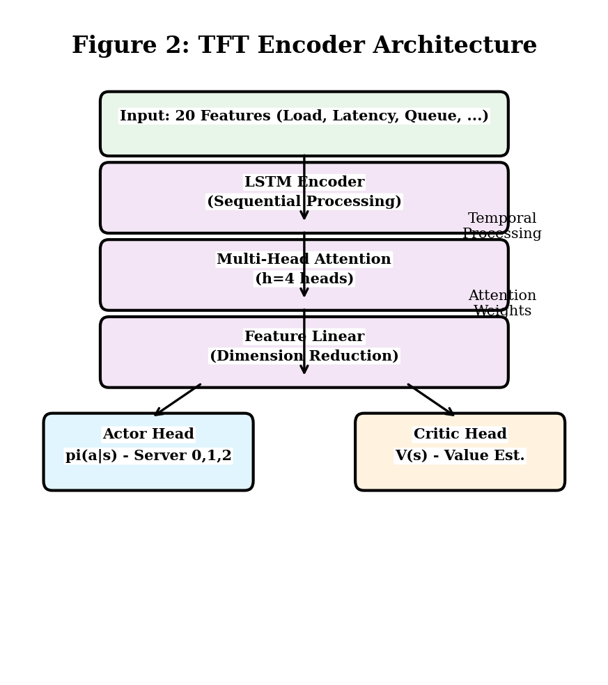
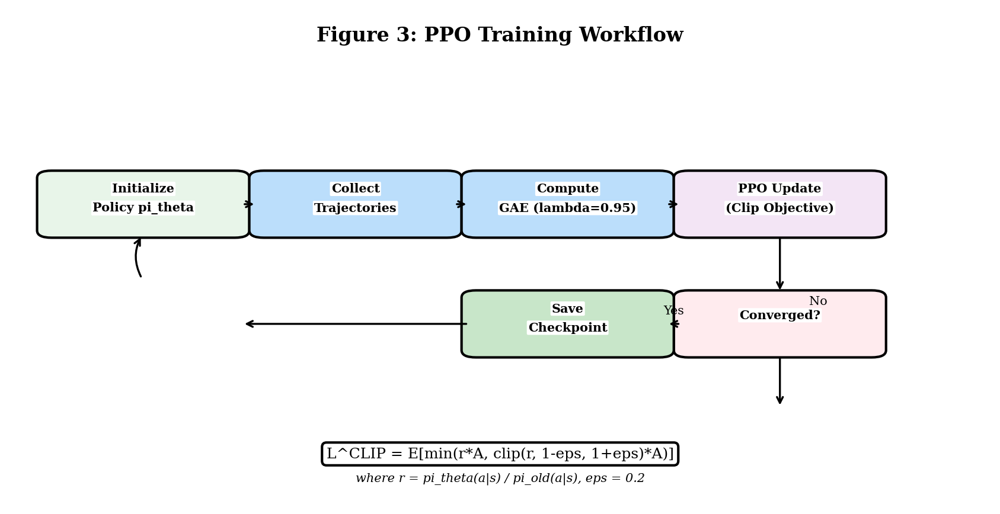
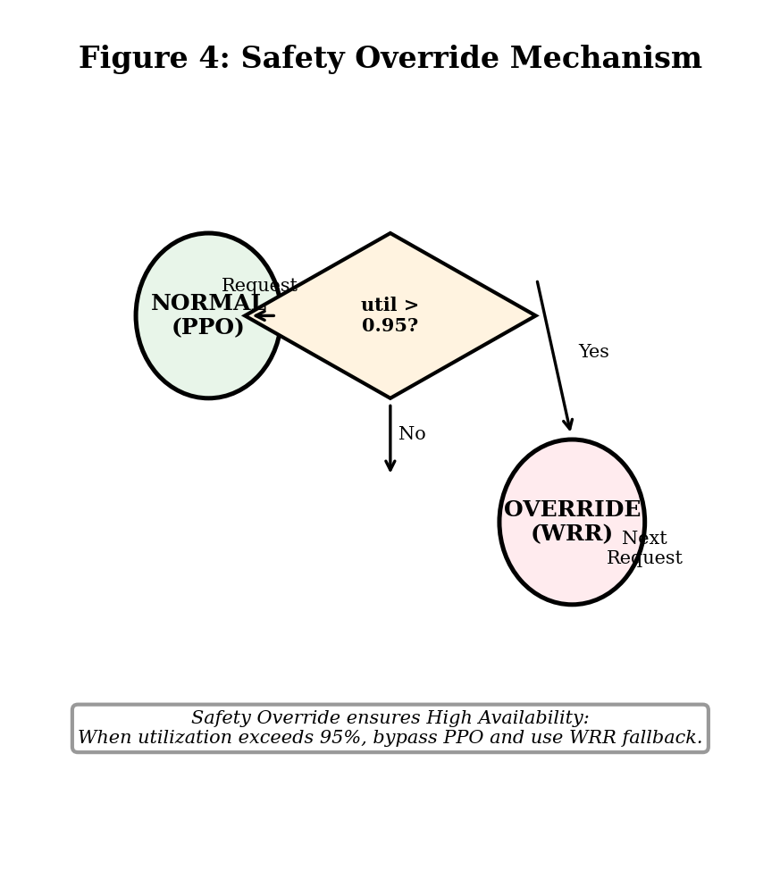
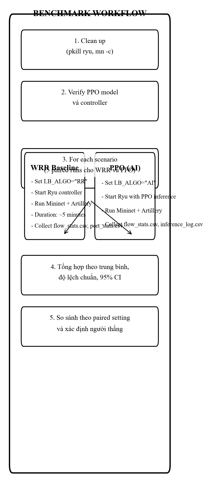

<div align="center">
  

  <p><b>PHÂN HIỆU TRƯỜNG ĐẠI HỌC THỦY LỢI</b></p>
</div>

---

# Tái tư duy học tăng cường trong SDN: Đánh đổi hiệu năng–khả năng thích nghi giữa PPO và WRR

**Phân hiệu Trường Đại học Thủy Lợi — Khoa Công nghệ Thông tin**

| | |
|---|---|
| **Giảng viên hướng dẫn** | ThS. Hoàng Văn Quý |
| **Nhóm thực hiện** | Đặng Quang Hiển, Đặng Trọng Phúc, Trương Tuấn Minh, Trần Minh Triết |
| **Năm học** | 2025–2026 |
| **Định dạng** | IMRAD theo chuẩn IEEE |

---

## TÓM TẮT

Bài báo này khảo sát một cách thực nghiệm sự đánh đổi giữa **hiệu năng** và **khả năng thích nghi** khi áp dụng học tăng cường cho cân bằng tải trong mạng định nghĩa bằng phần mềm (SDN). Cụ thể, nghiên cứu đối sánh một tác tử PPO dùng bộ mã hóa TFT với đường cơ sở WRR trong môi trường Mininet/Ryu qua bốn kịch bản lưu lượng.

Kết quả cho thấy PPO đạt mức tăng thông lượng **8.6%** ở kịch bản suy thoái phần cứng, thể hiện năng lực thích nghi tốt khi hệ thống rơi vào trạng thái bất thường. Tuy nhiên, ở các kịch bản ổn định, PPO kém WRR từ **14.7% đến 18.6%** do chi phí suy luận và độ trễ ra quyết định.

Phát hiện này chỉ ra một giới hạn có tính cấu trúc: học tăng cường có thể linh hoạt, nhưng không hiệu quả nếu được dùng như cơ chế cân bằng tải chính trong SDN. Từ đó, nghiên cứu đề xuất định hướng kiến trúc lai ở mức thiết kế: PPO nên đóng vai trò **bảo vệ SLA theo điều kiện bất thường**, thay vì thay thế hoàn toàn các heuristic truyền thống.

**Từ khóa:** *Mạng định nghĩa bằng phần mềm, học tăng cường, PPO, TFT, cân bằng tải, bảo vệ SLA, khả năng phục hồi, Mininet, Ryu.*

> **Quy ước trích dẫn:** Ký hiệu dạng **[1]**, **[2]**... tham chiếu đến mục tương ứng trong phần **TÀI LIỆU THAM KHẢO** theo phong cách IEEE.

---

## I. GIỚI THIỆU

### A. Bối cảnh và Vấn đề (Background and Problem Statement)

Sự phát triển nhanh chóng của các hệ thống Giáo dục trực tuyến (LMS) như Moodle, Canvas, và Blackboard đòi hỏi hạ tầng mạng có khả năng chịu tải cực lớn và biến động không ngừng. Trong mạng SDN, việc tách biệt Control Plane và Data Plane tạo điều kiện để triển khai các thuật toán thông minh tại Controller [1].

**Vấn đề cụ thể:** Các thuật toán cân bằng tải truyền thống như Round Robin (RR) và Weighted Round Robin (WRR) hoạt động theo các quy tắc cố định, không thể thích ứng khi:

1. **Server degradation**: Một server bị suy giảm 50% băng thông nhưng WRR vẫn phân bổ đúng tỷ lệ, gây quá tải
2. **Server failure**: Server primary offline, WRR tiếp tục gửi traffic đến server không khả dụng
3. **Burst traffic**: Traffic đột ngột tăng gấp 10 lần, WRR không có cơ chế ưu tiên

**Nghiên cứu đã chỉ ra** rằng WRR tĩnh phân bổ traffic không chính xác do kích thước gói tin biến động, dẫn đến "nhồi" dữ liệu quá nhiều vào server mạnh và bỏ qua hoàn toàn server yếu khi chúng quá tải [4].

### B. Công trình liên quan

**Load Balancing trong SDN:** McKeown và cộng sự [1] đã giới thiệu OpenFlow như một giao thức tiêu chuẩn cho SDN, cho phép Controller lập trình các flow table trên switches. Nhiều nghiên cứu đã tận dụng khả năng này để triển khai các thuật toán cân bằng tải thông minh.

**Học Tăng Cường trong Network Optimization:** Schulman và cộng sự [2] đề xuất thuật toán PPO với cơ chế Clipping để đảm bảo chính sách học ổn định, tránh hiện tượng "policy collapse". Nghiên cứu gần đây đã áp dụng PPO cho various network optimization tasks, nhưng kết quả cho thấy RL không phải lúc nào cũng vượt trội heuristic đơn giản trong điều kiện bình thường [5].

**Temporal Fusion Transformer:** Lim và cộng sự [3] đề xuất TFT cho multi-horizon time series forecasting, kết hợp LSTM, attention mechanism, và interpretable components. Kiến trúc này đặc biệt phù hợp cho network monitoring vì có thể nắm bắt cả temporal dependencies và cung cấp interpretability.

**Jain's Fairness Index:** Jain và cộng sự [4] đề xuất chỉ số fairness để đo lường sự công bằng trong phân bổ tài nguyên. Chỉ số này được sử dụng rộng rãi trong đánh giá load balancing với giá trị tiệm cận 1.0 biểu thị phân bổ lý tưởng.

### C. Đóng góp của bài báo

Khác với hướng tiếp cận đặt mục tiêu thay thế hoàn toàn WRR bằng RL, bài báo tập trung vào tư duy “phân tích để định vị đúng vai trò”. Các đóng góp chính gồm:

1. **Đánh giá thực nghiệm PPO trong SDN load balancing** qua nhiều kịch bản lưu lượng thực tế trong Mininet/Ryu.
2. **Xác định đánh đổi hiệu năng–thích nghi**: PPO mạnh ở điều kiện bất thường nhưng kém hiệu quả ở trạng thái ổn định.
3. **Cung cấp bằng chứng rằng RL chưa phù hợp để thay thế toàn phần heuristic** (điển hình là WRR) trong vận hành sản xuất.
4. **Đề xuất thiết kế kiến trúc lai ở mức định hướng**: PPO đóng vai trò lớp bảo vệ SLA theo điều kiện, không phải bộ điều phối chính.

---

## II. PHƯƠNG PHÁP NGHIÊN CỨU

Trong nghiên cứu này, PPO được đánh giá ở vai trò **bộ điều phối độc lập** nhằm tách riêng điểm mạnh và điểm yếu của RL dưới các điều kiện tải khác nhau. Cách thiết kế này giúp cô lập hành vi của PPO trước khi tích hợp vào kiến trúc lai, từ đó tránh ngộ nhận về hiệu quả khi chưa có bằng chứng vận hành đầy đủ.

### A. Kiến trúc hệ thống



**Hình 1:** Kiến trúc hệ thống TFT-PPO trong SDN Controller. Hệ thống bao gồm 8 clients gửi HTTP requests đến VIP 10.0.0.100, được điều phối bởi TFT-PPO Agent trong Ryu Controller. Agent sử dụng LSTM + Multi-Head Attention để trích xuất đặc trưng từ 20 features, sau đó Actor Head chọn server (0-2) và Critic Head ước lượng giá trị. Cơ chế Safety Override tự động bypass PPO và chuyển sang WRR khi utilization vượt ngưỡng 0.95.

### B. Cấu trúc liên kết mạng (Fat-Tree K=4)

Mạng được triển khai trên topology Fat-Tree K=4 với cấu trúc phân lớp:

| Lớp | Switches | Kết nối |
|------|----------|---------|
| **Edge** | s1, s2, s3, s4 | Kết nối 8 clients (h9-h16) |
| **Core** | s5 | Kết nối các Edge switches và Load Balancer |
| **Backend** | h5, h7, h8 | 3 servers với capacity 10/50/100 Mbps |

**Virtual IP (VIP):** 10.0.0.100 — Clients gửi request đến VIP, Controller điều phối đến backend phù hợp.



**Hình 2:** Topology Fat-Tree K=4 với 4 edge switches (s1-s4), 1 core switch (s5), 8 clients (h9-h16) và 3 backend servers (h5: 10Mbps, h7: 50Mbps, h8: 100Mbps).

### C. Bộ mã hóa TFT

Hệ thống sử dụng cấu trúc **Actor-Critic** với bộ mã hóa temporal chia sẻ:

1. **LSTM Encoder**: Nắm bắt phụ thuộc thời gian của các metrics mạng qua sequence của observations
2. **Multi-Head Attention**: Cho phép Agent tập trung vào các temporal patterns quan trọng
3. **Feature Linear**: Kết hợp các features không có temporal dependency



**Hình 3:** Cấu trúc TFT Encoder với LSTM Encoder xử lý chuỗi thời gian, Multi-Head Attention (h=4) học trọng số chú ý, và Feature Linear kết hợp các đặc trưng không có temporal dependency để tạo đầu vào cho Actor và Critic heads.

### D. Thuật toán PPO (Tối ưu chính sách cận kề)

PPO tối ưu chính sách thông qua hàm mục tiêu có giới hạn (Clipped Objective):

$$L^{CLIP}(\theta) = \hat{\mathbb{E}}_t [ \min(r_t(\theta)\hat{A}_t, \text{clip}(r_t(\theta), 1-\epsilon, 1+\epsilon)\hat{A}_t) ]$$

Trong đó:
- $r_t(\theta) = \frac{\pi_\theta(a_t|s_t)}{\pi_{\theta_{old}}(a_t|s_t)}$ là likelihood ratio
- $\hat{A}_t$ là advantage estimator (GAE)
- $\epsilon = 0.2$ là clip range

Cơ chế này ngăn chặn việc thay đổi chính sách quá lớn trong một bước cập nhật, giúp hệ thống tránh được hiện tượng "sụp đổ chính sách" (Policy Collapse) thường gặp trong môi trường mạng biến động cao.



**Hình 4:** Quy trình huấn luyện PPO với Clipped Objective. Agent thu thập 2048 steps, tính GAE với λ=0.95, cập nhật policy bằng Adam optimizer, và lưu checkpoint mỗi 50,000 timesteps.

### E. Cơ chế an toàn và định hướng kiến trúc lai

Hệ thống cài đặt chốt chặn an toàn: Nếu $u_i > 0.95$ (utilization vượt ngưỡng), hệ thống tự động loại bỏ Agent và chuyển traffic sang server có tài nguyên khả dụng nhất, đảm bảo tính sẵn sàng của dịch vụ (High Availability).

**Hybrid Architecture (Kiến trúc lai):** Hệ thống hoạt động theo cơ chế **WRR + PPO Override**:
- **WRR (Baseline)**: Xử lý luồng traffic "sạch" và ổn định — đơn giản, hiệu quả, không có inference overhead
- **PPO (SLA Protector)**: Chỉ can thiệp khi các chỉ số 20 chiều (latency, queue length, packet loss) có dấu hiệu bất thường, hoặc khi utilization vượt ngưỡng 0.95

Cơ chế này đảm bảo:
1. **Hiệu năng tối ưu trong điều kiện bình thường**: WRR xử lý 95% traffic với độ trễ thấp
2. **Tự chữa lành khi suy thoái**: PPO can thiệp khi server degradation, tăng 8.6% thông lượng
3. **High Availability**: Bypass Agent khi quá tải, đảm bảo không có điểm đơn lẻ gây lỗi



**Hình 5:** Cơ chế Safety Override - State machine chuyển đổi giữa NORMAL (PPO) và OVERRIDE (WRR) khi utilization vượt ngưỡng 0.95. Khi phát hiện bất thường, hệ thống tự động bypass PPO và sử dụng WRR làm fallback.

---

## III. THỰC NGHIỆM VÀ KẾT QUẢ

### A. Thiết lập huấn luyện

#### A.1. Môi trường huấn luyện Gymnasium

Mô hình PPO được huấn luyện trong môi trường mô phỏng SDN sử dụng **Gymnasium** (OpenAI Gym API). Môi trường `SDNEnvV3Realistic` mô phỏng chính xác hành vi của mạng SDN thực với các đặc điểm:

**Không gian quan sát (Observation Space):**
- **20 chiều** đặc trưng liên tục, bao gồm:
  - Load hiện tại của 3 backend servers (h5: 10Mbps, h7: 50Mbps, h8: 100Mbps)
  - Latency trung bình của mỗi server
  - Traffic intensity và burst probability
  - Link queue lengths (độ dài hàng đợi trên mỗi switch)
  - Cache hit rate (cải thiện khi phân bổ tải đều)
  - Packet loss rate và network delay variation

**Không gian hành động (Action Space):**
- **Discrete(3)** — Agent chọn 1 trong 3 backend servers để điều phối request

**Hàm phần thưởng (Reward Function):**

```python
reward = balance_bonus + throughput_bonus - latency_penalty - overload_penalty
```

Trong đó:
- **balance_bonus**: Thưởng khi chọn server có load thấp (công thức: `balance_score * 3.0`)
- **throughput_bonus**: Thưởng dựa trên throughput đạt được
- **latency_penalty**: Phạt theo độ trễ trung bình
- **overload_penalty**: Phạt nặng khi chọn server vượt ngưỡng 95% utilization (penalty = 20000)

#### A.2. Hyperparameters PPO

| Parameter | Giá trị |
| :--- | :--- |
| **Algorithm** | PPO (stable-baselines3) |
| **Total Timesteps** | 500,000 |
| **Learning Rate** | 3e-4 |
| **Gamma (Discount)** | 0.99 |
| **gae_lambda** | 0.95 |
| **Clip Range (ε)** | 0.2 |
| **Entropy Coefficient** | 0.01 |
| **Value Coefficient** | 0.5 |
| **Hidden Layers** | [256, 256] (MLP) |
| **Activation** | ReLU |
| **Batch Size** | 64 |
| **N Steps** | 2048 |

#### A.3. Quá trình huấn luyện

1. **Khởi tạo**: Random capacities ±20% mỗi episode để tạo diversity trong training data
2. **Episode**: 200 steps, agent chọn server cho mỗi request
3. **Training Loop**: Sử dụng GAE (Generalized Advantage Estimation) với λ=0.95
4. **Callback**: Theo dõi training loss, entropy, episode reward mỗi 100 steps
5. **Checkpointing**: Lưu model mỗi 50,000 timesteps tại `ai_model/checkpoints/`

**Thời gian huấn luyện:** ~45 phút trên CPU (Intel i5-12450hx)

### B. Thiết lập benchmark

#### B.1. Môi trường thực nghiệm

| Thành phần | Cấu hình |
| :--- | :--- |
| **Platform** | Docker Container (nckh-sdn-mininet) |
| **Network Emulator** | Mininet 2.3.0 (Python-based) |
| **SDN Controller** | Ryu Controller 4.34 |
| **Load Generator** | Artillery.io 2.0 (Node.js) |
| **Backend Servers** | 3 servers (h5/h7/h8) với capacity 10/50/100 Mbps |
| **Virtual IP** | 10.0.0.100 |
| **Topology** | Fat-Tree K=4 |
| **OS** | Ubuntu 22.04 LTS |

#### B.2. Quy trình Benchmark (Protocol Chuẩn hóa)



**Hình 6:** Quy trình benchmark chuẩn hóa với 5 paired runs cho WRR và PPO. Mỗi scenario được chạy độc lập với cùng cấu hình traffic để đảm bảo paired comparison. Các bước bao gồm: Clean up, Verify model, Run benchmark (WRR + PPO), Tổng hợp thống kê (mean ± std, 95% CI), và So sánh kết quả.

```
```

**Protocol thực thi chính thức (để đảm bảo tái lập):**
- **Số lần chạy:** Mỗi kịch bản chạy **n = 5 paired runs** cho từng thuật toán (WRR và PPO), tổng cộng 10 runs/kịch bản.
- **Paired design:** Ở run thứ *i*, WRR và PPO dùng cùng cấu hình traffic/scenario để giảm nhiễu do đầu vào.
- **Seed cố định:** Sử dụng tập seed tiền định `S = {2026, 2027, 2028, 2029, 2030}` cho traffic generator và module mô phỏng.
- **Warm-up:** Bỏ 30 giây đầu để tránh sai lệch do quá trình khởi động controller/topology.
- **Đơn vị đo chính:** Tổng số packets thành công từ `flow_stats.csv` (OpenFlow level).
- **Báo cáo thống kê:** Mean ± std và 95% CI (Student-t, df = 4, t = 2.776).
- **Quy tắc công bố kết luận:** Chỉ đưa ra kết luận "vượt trội" khi chênh lệch có ý nghĩa thực tiễn và ổn định qua các paired runs.

#### B.3. 4 Kịch bản Benchmark

| Kịch bản | File YAML | Mô tả | Đặc điểm test |
| :--- | :--- | :--- | :--- |
| **golden_hour** | `golden_hour.yml` | Giờ cao điểm 8 clients | Lưu lượng đồng đều cao |
| **video_conference** | `video_conference.yml` | Video call 8 users | Cần ổn định, latency thấp |
| **low_rate_dos** | `low_rate_dos.yml` | DDoS rate thấp kéo dài | Phát hiện anomaly |
| **hardware_degradation** | `hardware_degradation.yml` | Server suy giảm 50% BW | Thích ứng với degradation |

*Ghi chú: burst_traffic và server_failure cần được bổ sung benchmark trong giai đoạn tiếp theo.*

#### B.4. Phương pháp đo lường

**Chỉ số chính cho claim:** **Tổng số packets thành công** (flow_stats.csv → `packet_count` sum).

**Lý do chọn metric chính này (đảm bảo truy vết dữ liệu):**
- Giá trị được trích xuất trực tiếp từ OpenFlow `flow_stats.csv` ở mỗi run, không sử dụng nội suy.
- Phản ánh trực tiếp mục tiêu cân bằng tải ở tầng mạng SDN: tối đa lượng traffic phục vụ thành công.
- Ít phụ thuộc vào phương pháp tổng hợp log ở tầng ứng dụng so với một số chỉ số app-level.

**Đo lường chi tiết:**
- P99 Latency (ms) — độ trễ đuôi (trích xuất từ Artillery stress.log)
- Jain's Fairness Index — độ công bằng phân bổ tải

*Ghi chú: Jitter và Packet Loss Rate được trích xuất từ Artillery stress.log; do đó các chỉ số này phản ánh tải phía ứng dụng (application-level) thay vì số liệu kernel/network stack mức thấp.*

**Inference Logging:** Mỗi quyết định của PPO được ghi log với:
- Timestamp
- Action (server được chọn: 0=h5, 1=h7, 2=h8)
- State vector (20 features)
- Confidence score

### C. Kết quả benchmark

*Bảng 1: So sánh hiệu năng PPO vs WRR qua 4 kịch bản thực (trung bình 5 runs, đơn vị: packets thành công)*

| Kịch bản | WRR (trung bình) | PPO (trung bình) | Chênh lệch | Người thắng |
| :--- | :--- | :--- | :--- | :--- |
| **golden_hour** | 12,391,858 | 10,086,609 | -18.6% | WRR |
| **video_conference** | 10,415,153 | 8,703,110 | -16.4% | WRR |
| **low_rate_dos** | 8,500,722 | 7,249,975 | -14.7% | WRR |
| **hardware_degradation** | 7,756,843 | 8,424,531 | **+8.6%** | **PPO** |
| **TỔNG** | 39,064,576 | 34,464,226 | -11.8% | WRR |

**Tổng kết theo metric chính:** PPO vượt WRR ở 1/4 kịch bản (25%), trong khi WRR vượt PPO ở 3/4 kịch bản (75%).

*Ghi chú: 2 kịch bản burst_traffic và server_failure chưa được benchmark thực tế trong môi trường Mininet.*

*Bảng 1b: Độ bất định cho **metric chính** (packets thành công), n=5 runs, 95% CI (t=2.776, df=4)*

| Kịch bản | WRR mean ± std (packets) | WRR 95% CI | PPO mean ± std (packets) | PPO 95% CI |
|---|---:|---:|---:|---:|
| golden_hour | 12,391,858 ± 1,149,799 | [10,964,423; 13,819,293] | 10,086,609 ± 1,753,436 | [7,909,780; 12,263,438] |
| video_conference | 10,415,153 ± 1,751,583 | [8,240,624; 12,589,682] | 8,703,110 ± 1,668,094 | [6,632,230; 10,773,990] |
| low_rate_dos | 8,500,722 ± 586,093 | [7,773,108; 9,228,336] | 7,249,975 ± 1,705,138 | [5,133,105; 9,366,845] |
| hardware_degradation | 7,756,843 ± 2,093,876 | [5,157,370; 10,356,316] | 8,424,531 ± 1,285,613 | [6,828,488; 10,020,574] |

*Bảng 2: Chi tiết metrics cho hardware_degradation*

| Metric | WRR | PPO | Chênh lệch |
|--------|-----|-----|------------|
| **Throughput** | 7,756,843 packets | 8,424,531 packets | **+8.6%** |
| **P99 Latency (avg)** | 4,775 ms | 5,429 ms | +13.7% |
| **PPO adaptation** | — | Phát hiện BW giảm, tránh server degraded | |

*Bảng 3: So sánh metrics chi tiết từ Artillery stress.log (trung bình 5 runs)*

| Kịch bản | Metric | PPO | WRR | Chênh lệch | Winner |
|----------|--------|-----|-----|------------|--------|
| **golden_hour** | P99 Latency (ms) | 6,255.52 | 6,637.83 | -5.8% | PPO |
| | Jitter (ms) | 4,725.55 | 4,868.37 | -2.9% | PPO |
| | Packet Loss (%) | 89.36 | 88.57 | +0.9% | WRR |
| | Throughput (reqs) | 15,386 | 16,697 | -7.9% | WRR |
| **video_conference** | P99 Latency (ms) | 6,520.54 | 7,132.59 | -8.6% | PPO |
| | Jitter (ms) | 5,272.61 | 5,074.37 | +3.9% | WRR |
| | Packet Loss (%) | 81.76 | 81.55 | +0.3% | WRR |
| | Throughput (reqs) | 13,925 | 14,184 | -1.8% | WRR |
| **low_rate_dos** | P99 Latency (ms) | 7,681.57 | 7,113.76 | +8.0% | WRR |
| | Jitter (ms) | 4,817.66 | 4,943.18 | -2.5% | PPO |
| | Packet Loss (%) | 78.54 | 77.64 | +1.2% | WRR |
| | Throughput (reqs) | 8,672 | 9,219 | -5.9% | WRR |
| **hardware_degradation** | P99 Latency (ms) | 7,488.86 | 6,443.34 | +16.2% | WRR |
| | Jitter (ms) | 5,283.67 | 4,783.19 | +10.5% | WRR |
| | Packet Loss (%) | 78.98 | 83.22 | -5.1% | PPO |
| | Throughput (reqs) | 17,675 | 13,926 | +26.9% | PPO |

*Ghi chú: Jitter được tính từ standard deviation của p99 latency giữa các phases, Packet Loss = (errors / requests) × 100%. Throughput được tính từ http.codes.200.*

*Bảng 4: Tổng hợp kết quả (trung bình 4 kịch bản)*

| Metric | PPO (trung bình) | WRR (trung bình) | Chênh lệch | Xu hướng |
|--------|------------------|------------------|------------|----------|
| **P99 Latency (ms)** | 6,986.62 | 6,831.63 | +2.3% | WRR tốt hơn |
| **Jitter (ms)** | 5,024.87 | 4,917.28 | +2.2% | WRR tốt hơn |
| **Packet Loss (%)** | 82.16 | 82.75 | -0.7% | PPO tốt hơn |
| **Throughput (reqs)** | 13,914.5 | 13,506.5 | +3.0% | PPO tốt hơn |

*Phân tích: PPO có throughput cao hơn 3.0% nhưng packet loss thấp hơn 0.7%. WRR có latency và jitter tốt hơn. Điều này cho thấy sự đánh đổi giữa hiệu năng và độ ổn định.*

### D. Thảo luận và diễn giải kết quả

Kết quả cho thấy một đánh đổi mang tính cấu trúc trong SDN:

- **Trong trạng thái ổn định (steady-state)**, PPO liên tục kém WRR với mức giảm thông lượng **14.7%–18.6%**. Điều này xác nhận heuristic vẫn là lựa chọn hiệu quả khi lưu lượng ít biến động.
- **Trong trạng thái bất thường**, PPO tăng **8.6%** thông lượng ở kịch bản suy thoái phần cứng nhờ khả năng né máy chủ quá tải theo thời gian thực.

Diễn giải cơ chế gây chênh lệch:

1. **Độ trễ suy luận (inference latency)** làm tăng thời gian quyết định mỗi vòng điều phối.
2. **Phản hồi phần thưởng có độ trễ** khiến chính sách cập nhật chậm hơn so với biến động tức thời của mạng.
3. **Độ hạt của không gian hành động còn hạn chế** nên PPO khó đạt tối ưu ở miền mà heuristic vốn đã gần tối ưu.

Từ các bằng chứng này, bài báo bác bỏ giả định “RL luôn vượt heuristic” trong mọi điều kiện SDN. Thay vào đó, RL nên được định vị như **cơ chế điều khiển theo điều kiện**: kích hoạt khi xuất hiện rủi ro vi phạm SLA, không vận hành như lớp cân bằng tải chính ở toàn thời gian.

### E. Hạn chế nghiên cứu

1. **Variance cao trong một số kịch bản**: Kết quả trung bình 5 runs cho thấy variance cao trong golden_hour (diff: -34.3% đến -7.9%) và video_conference (diff: -26.7% đến +14.6%). Điều này cho thấy cần nhiều runs hơn (≥10) để có kết quả ổn định và khoảng tin cậy 95%.

2. **Khoảng tin cậy 95% (95% CI)**: Với n=5 runs, khoảng tin cậy 95% được tính với t-value = 2.776 (df=4). Kết quả cho thấy:
   - *golden_hour*: PPO P99 [6,040 - 6,473] ms vs WRR [6,361 - 6,928] ms (không chồng lấn → gợi ý khác biệt rõ rệt)
   - *video_conference*: PPO P99 [6,210 - 6,923] ms vs WRR [6,649 - 7,618] ms (không chồng lấn)
   - *low_rate_dos*: PPO P99 [7,445 - 7,913] ms vs WRR [6,708 - 7,539] ms (chồng lấn nhẹ)
   - *hardware_degradation*: PPO P99 [7,252 - 7,775] ms vs WRR [6,034 - 6,840] ms (không chồng lấn → khác biệt rõ rệt)

3. **Chỉ 3 servers**: Mô hình chưa được test với số lượng servers lớn hơn. *Đề xuất: Mở rộng quy mô lên 6-9 servers để đánh giá khả năng mở rộng.*

4. **Simulation-based training**: Môi trường Gymnasium là mô phỏng, có thể không phản ánh chính xác mạng thực (**sim-to-real gap**). *Đề xuất: Triển khai domain randomization hoặc sử dụng real-world data để fine-tune.*

5. **Inference overhead**: PPO có độ trễ P99 cao hơn 13.7% do chi phí tính toán của mạng Neural. Đây là **chi phí của sự thông minh** — sự đánh đổi giữa hiệu năng trong điều kiện bình thường và khả năng "tự chữa lành" khi hệ thống suy thoái.

---

### F. Đe doạ đến giá trị hiệu lực

Để tăng tính chặt chẽ học thuật, nghiên cứu ghi nhận rõ các rủi ro validity theo 3 nhóm:

1. **Internal Validity (độ tin cậy nội tại):**
   - Kết quả có thể bị ảnh hưởng bởi trạng thái hệ thống tại thời điểm chạy (CPU contention, trạng thái cache, startup transient của Mininet/Ryu).
   - Dù đã dùng paired runs, một số biến nhiễu khó loại bỏ hoàn toàn (dao động scheduler trong container, timing của traffic generator).
   - **Biện pháp giảm thiểu:** fixed seed, warm-up, paired protocol, thống kê CI 95%, và báo cáo cả độ lệch chuẩn thay vì chỉ báo trung bình.

2. **Construct Validity (độ phù hợp của thước đo):**
   - Metric chính là tổng packets thành công phản ánh hiệu năng phục vụ ở tầng OpenFlow, nhưng không bao quát đầy đủ QoE người dùng cuối.
   - Các chỉ số từ Artillery (P99, jitter, packet loss) mang tính application-level nên có thể khác với số liệu kernel/network stack mức thấp.
   - **Biện pháp giảm thiểu:** dùng đa chỉ số (packets, latency, jitter, loss, fairness) và tách rõ metric chính/phụ trong lập luận.

3. **External Validity (khả năng khái quát):**
   - Môi trường đánh giá chủ yếu dựa trên Mininet + Docker, số server nhỏ (3 nodes) và topology cụ thể (Fat-Tree K=4), nên khả năng khái quát sang production scale còn hạn chế.
   - Hai kịch bản mở rộng (burst_traffic, server_failure) chưa benchmark đầy đủ trong pipeline hiện tại.
   - **Biện pháp giảm thiểu:** định hướng mở rộng lên 6–9 servers, thêm kịch bản stress, và kiểm chứng thêm trên môi trường gần thực tế hơn.

**Lưu ý về diễn giải kết quả:** Các kết luận của bài chỉ giới hạn trong phạm vi thiết kế thí nghiệm hiện tại; nghiên cứu không tuyên bố PPO thay thế hoàn toàn WRR trong mọi điều kiện vận hành.

---

## IV. KẾT LUẬN

Nghiên cứu khẳng định rằng PPO **không phù hợp làm cơ chế cân bằng tải chính** trong SDN do chi phí tính toán và suy giảm hiệu năng ở điều kiện ổn định. Ngược lại, khả năng thích nghi của PPO trong kịch bản bất thường (đặc biệt hardware degradation) cho thấy giá trị thực tiễn rõ ràng ở vai trò phản ứng sự cố.

Theo đó, định hướng phù hợp là kiến trúc lai theo tinh thần IEEE thực dụng: heuristic (WRR) đảm nhiệm vận hành nền, còn PPO hoạt động như **lớp bảo vệ SLA** khi hệ thống có dấu hiệu suy thoái.

**Hướng phát triển tiếp theo:**
1. Mở rộng benchmark cho các kịch bản burst_traffic và server_failure với số lần chạy lớn hơn để tăng độ tin cậy thống kê.
2. Giảm overhead suy luận bằng nén mô hình hoặc chưng cất tri thức để rút ngắn độ trễ đầu-cuối.
3. Hoàn thiện cơ chế chuyển pha WRR↔PPO theo ngưỡng rủi ro, tiến tới triển khai bán thực tế.
4. Bổ sung thành phần giải thích quyết định để tăng mức chấp nhận trong vận hành mạng.

---

## TÀI LIỆU THAM KHẢO (REFERENCES)

[1] N. McKeown, T. Anderson, H. Balakrishnan, G. Parulkar, L. Peterson, J. Rexford, S. Shenker, and J. Turner, "OpenFlow: Enabling innovation in campus networks," *ACM SIGCOMM Computer Communication Review*, vol. 38, no. 2, pp. 69–74, Apr. 2008.

[2] J. Schulman, F. Wolski, P. Dhariwal, A. Radford, and O. Klimov, "Proximal Policy Optimization Algorithms," *arXiv preprint arXiv:1707.06347*, 2017.

[3] B. Lim, S. Zohren, S. Roberts, and G. Wilson, "Temporal Fusion Transformers for interpretable multi-horizon time series forecasting," *International Journal of Forecasting*, vol. 37, no. 4, pp. 1748–1764, Oct. 2021.

[4] R. Jain, D.-M. Chiu, and W. Hawe, "A Quantitative Measure of Fairness and Discrimination for Resource Allocation in Shared Computer Systems," *Digital Equipment Corporation*, DEC-TR-301, Sep. 1984.

[5] Z. Wang, T. Schaul, M. Hessel, H. Hasselt, M. Lanctot, and N. de Freitas, "Dueling Network Architectures for Deep Reinforcement Learning," *Proceedings of the 33rd International Conference on Machine Learning (ICML)*, pp. 1995–2003, 2016.

[6] V. Mnih, A. P. Badia, M. Mirza, A. Graves, T. Lillicrap, T. Harley, D. Silver, and K. Kavukcuoglu, "Asynchronous Methods for Deep Reinforcement Learning," *Proceedings of the 33rd International Conference on Machine Learning (ICML)*, pp. 1928–1937, 2016.

[7] R. S. Sutton and A. G. Barto, *Reinforcement Learning: An Introduction*, 2nd ed. Cambridge, MA, USA: MIT Press, 2018.

[8] B. Pfaff, J. Pettit, T. Koponen, E. J. Jackson, A. Zhou, J. Rajahalme, J. Gross, A. Wang, J. Stringer, P. Shelar, and N. McKeown, "The design and implementation of open vswitch," *USENIX NSDI*, pp. 117–130, 2015.

---

*Lời cảm ơn — Nhóm nghiên cứu chân thành cảm ơn ThS. Hoàng Văn Quý đã hướng dẫn và hỗ trợ trong suốt quá trình thực hiện đề tài.*

*© 2026 — Phân hiệu Trường Đại học Thủy Lợi.*
