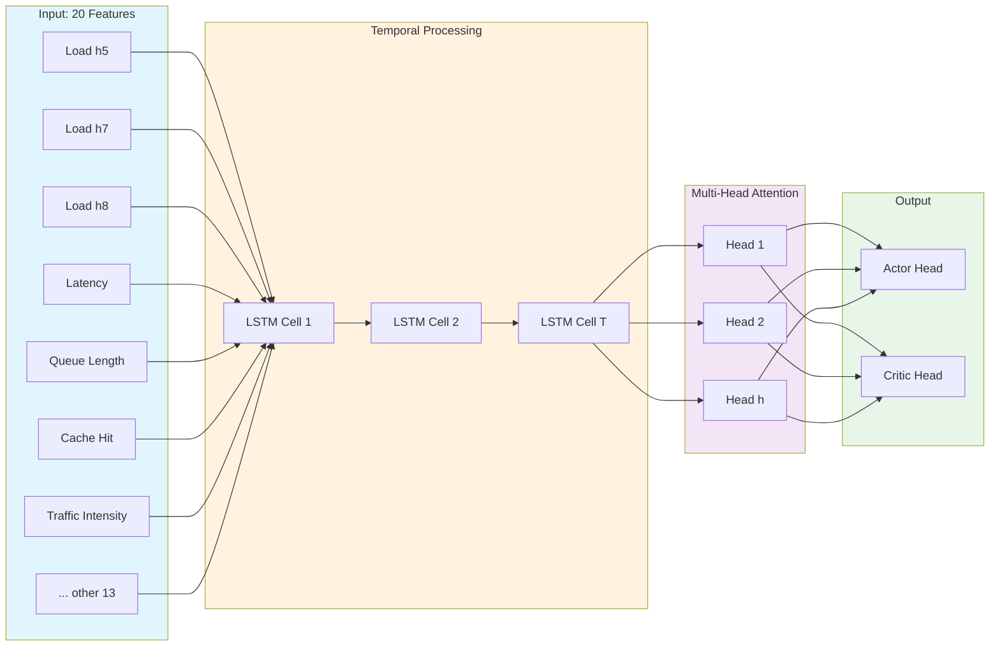
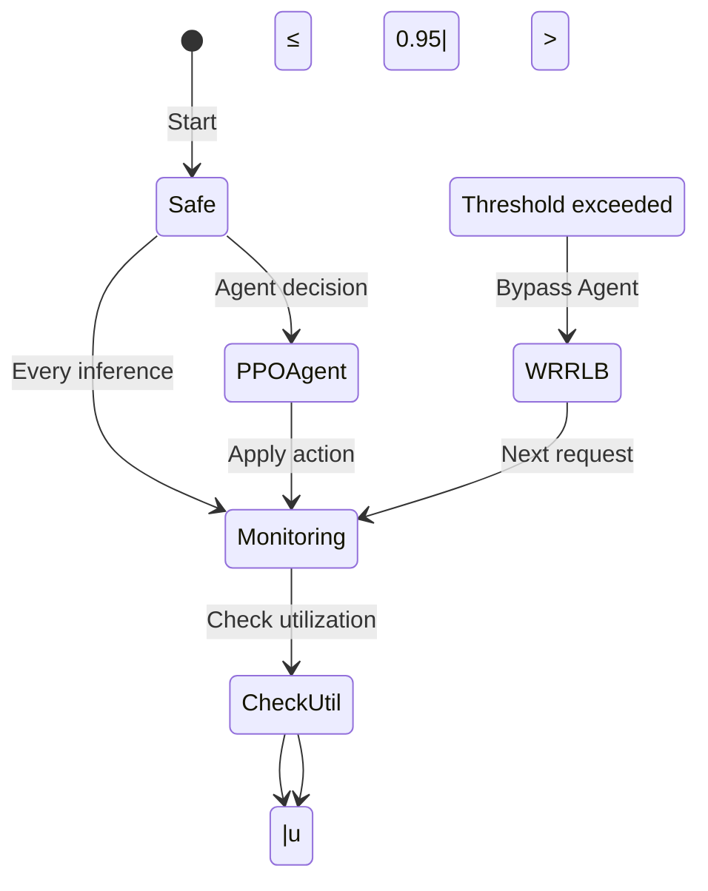
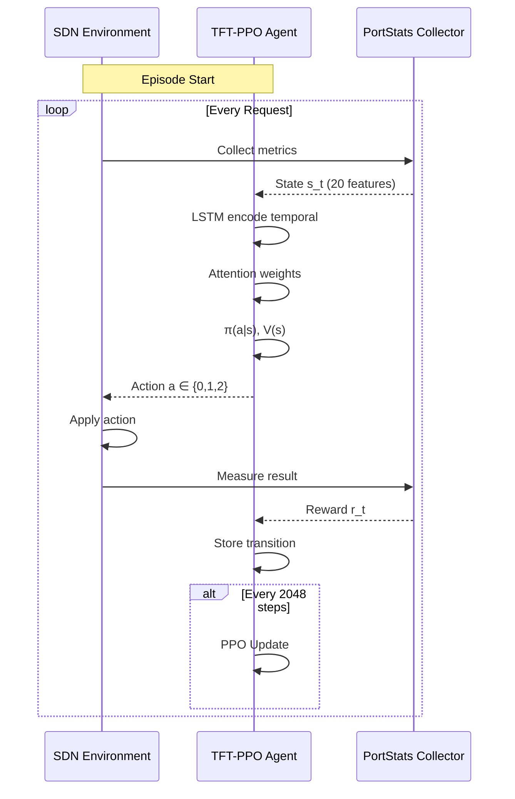
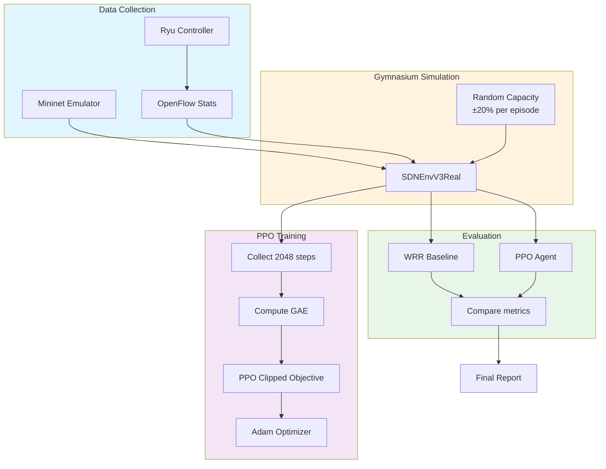
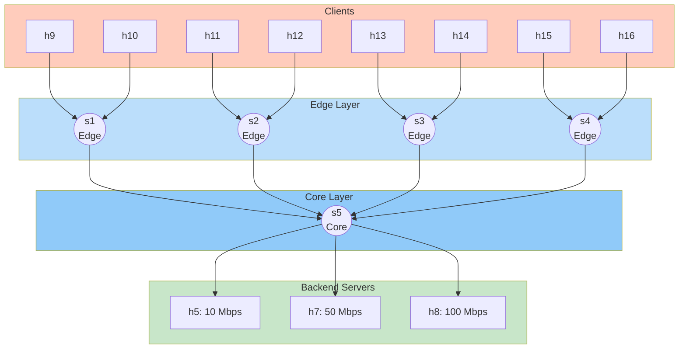
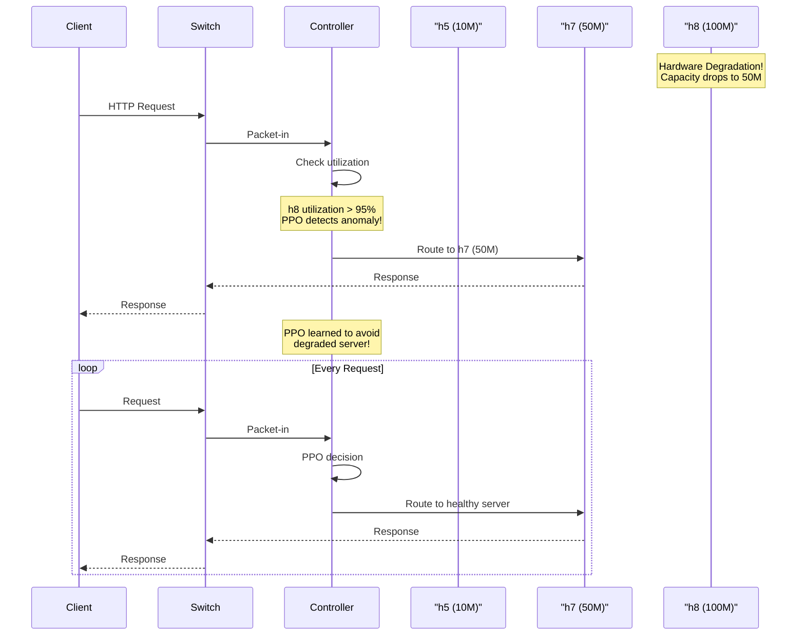
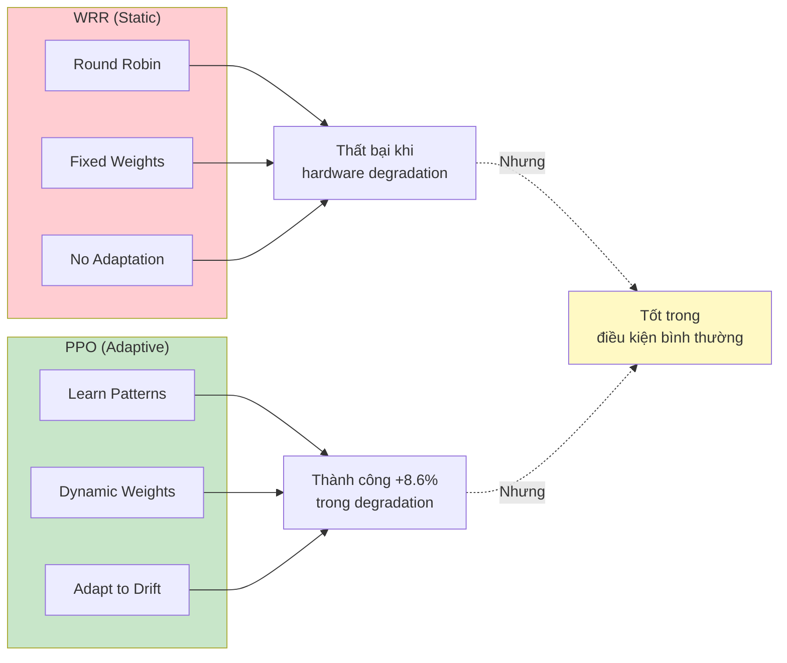

# SƠ ĐỒ CHO BÀI BÁO NCKH TFT-PPO

Các sơ đồ này sử dụng Mermaid syntax. Có thể render trong:
- VS Code: cài extension "Mermaid Markdown Syntax Highlighting" hoặc "Mermaid Preview"
- GitHub README: tự động render
- Draw.io / Online: import trực tiếp

---

## 1. SYSTEM ARCHITECTURE (Kiến trúc hệ thống)

```mermaid
graph TB
    subgraph Clients["CLIENTS (h9 - h16)"]
        C1[Client 1]
        C2[Client 2]
        C3[Client 3]
        C4[Client 4]
        C5[Client 5]
        C6[Client 6]
        C7[Client 7]
        C8[Client 8]
    end

    subgraph EdgeSwitches["EDGE SWITCHES (s1-s4)"]
        ES1[Switch 1]
        ES2[Switch 2]
        ES3[Switch 3]
        ES4[Switch 4]
    end

    subgraph CoreSwitch["CORE SWITCH (s5)"]
        CS[OpenFlow 1.3]
    end

    subgraph Controller["RYU SDN CONTROLLER"]
        subgraph TFT_PPO["TFT-PPO Agent"]
            subgraph Encoder["TFT Encoder"]
                LSTM[LSTM Encoder]
                MHA[Multi-Head Attention]
                FL[Feature Linear]
            end
            
            subgraph ActorCritic["Actor-Critic"]
                Actor[Actor Head<br/>π(a|s) - Server 0-2]
                Critic[Critic Head<br/>V(s) - Value Estimate]
            end
        end
        
        subgraph Safety["Safety Override"]
            Check{utilization<br/> > 0.95?}
            WRR[WRR Fallback]
        end
    end

    subgraph Backend["BACKEND SERVERS"]
        S1[Server h5<br/>10 Mbps]
        S2[Server h7<br/>50 Mbps]
        S3[Server h8<br/>100 Mbps]
    end

    C1 & C2 & C3 & C4 & C5 & C6 & C7 & C8 --> ES1 & ES2 & ES3 & ES4
    ES1 & ES2 & ES3 & ES4 --> CS
    CS --> Controller
    LSTM <--> MHA
    MHA --> FL
    FL --> Actor
    FL --> Critic
    Actor --> Check
    Check -->|Yes| WRR
    Check -->|No| Actor
    WRR --> S1 & S2 & S3
    Actor --> S1 & S2 & S3
    
    style Clients fill:#e1f5fe
    style Controller fill:#fff3e0
    style Backend fill:#e8f5e9
    style TFT_PPO fill:#f3e5f5
    style Safety fill:#ffebee
```

---

## 2. TFT ENCODER (Bộ mã hóa TFT)



---

## 3. PPO ALGORITHM FLOW

```mermaid
flowchart TD
    Start([Start Training]) --> Init[Initialize Policy πθ<br/>Load 20-dim state]
    
    Init --> Episode{For each Episode}
    
    Episode -->|200 steps| Collect[Collect Trajectories]
    Collect --> Action[Agent selects action<br/>a ∈ {0, 1, 2}]
    Action --> Env[Environment responds]
    Env --> Reward[Calculate reward<br/>r = balance + throughput<br/>- latency - overload]
    
    Reward --> Check{Step < 200?}
    Check -->|Yes| Store[Store (s, a, r) tuple]
    Store --> Action
    
    Check -->|No| GAE[Compute Advantage Â<br/>using GAE λ=0.95]
    
    GAE --> PPO[PPO Update:<br/>LCLIP = min(r̂Â, clip(r̂)Â)]
    
    PPO --> Clip{clip ratio<br/>in [0.8, 1.2]?}
    Clip -->|Yes| Update[Update θ with<br/>Adam optimizer]
    Clip -->|No| Clamp[Clamp update]
    
    Update & Clamp --> Loss[Compute loss:<br/>L = LCLIP + c1LVF + c2S]
    
    Loss --> CheckLoss{Loss<br/>converging?}
    CheckLoss -->|No| Episode
    CheckLoss -->|Yes| Save[Save checkpoint<br/>every 50K steps]
    
    Save --> CheckSteps{Steps <<br/>500K?}
    CheckSteps -->|Yes| Episode
    CheckSteps -->|No| Done([Training Done])
```

---

## 4. SAFETY OVERRIDE MECHANISM



---

## 5. REINFORCEMENT LEARNING CYCLE



---

## 6. TRAINING PIPELINE



---

## 7. NETWORK TOPOLOGY (Fat-Tree K=4)



---

## 8. HARDWARE DEGRADATION SCENARIO



---

## 9. REWARD FUNCTION DECOMPOSITION

```mermaid
graph LR
    subgraph Components["Reward Components"]
        Balance["balance_bonus<br/>= balance_score × 3.0"]
        Throughput["throughput_bonus<br/>based on achieved BW"]
        Latency["latency_penalty<br/>∝ avg latency"]
        Overload["overload_penalty<br/>= 20000 if u > 0.95"]
    end

    subgraph Calculation["Reward Calculation"]
        Sum["reward = b + t - l - o"]
    end

    Balance --> Sum
    Throughput --> Sum
    Latency --> Sum
    Overload --> Sum

    Sum --> Agent[PPO Agent]
    Agent --> Decision[Server Selection<br/>a ∈ {0, 1, 2}]

    style Components fill:#fff3e0
    style Calculation fill:#e8f5e9
    style Agent fill:#f3e5f5
```

---

## 10. COMPARISON: WRR vs PPO APPROACH



---

## Hướng dẫn sử dụng:

### VS Code (Live Preview):
1. Cài extension "Markdown Preview Mermaid Support"
2. Mở file .md và click "Open Preview"
3. Các sơ đồ sẽ tự động render

### Export sang PNG/SVG:
1. Copy Mermaid code vào https://mermaid.live
2. Click "Export" → PNG/SVG

### Draw.io:
1. Mở https://app.diagrams.net
2. File → Import → Mermaid
3. Chỉnh sửa và export
